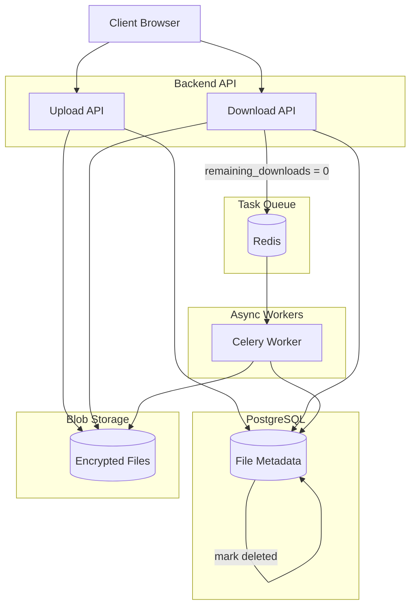

# Backend

The backend handles file deletion and file storage:

<small>
    The [frontend architecture](../frontend/architecture.md) and the [overall architecture](../architecture/index.md)
</small>
