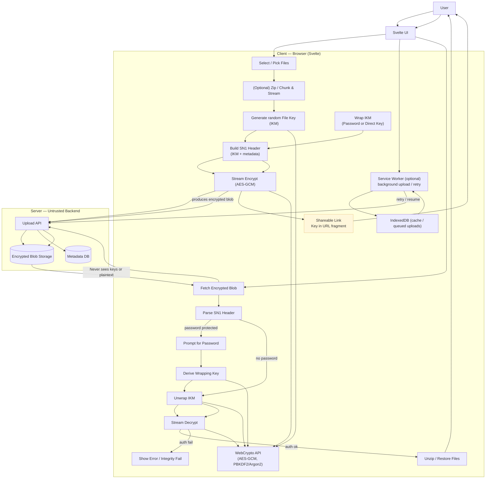

# Frontend

The frontend performs client-side encryption and supports background-safe uploads (Service Worker + IndexedDB).

The diagram below shows the major components and flows — note that the backend never sees unencrypted keys or plaintext:

<small>
    The [backend architecture](../backend/architecture.md) and the [overall architecture](../architecture/index.md)
</small>
